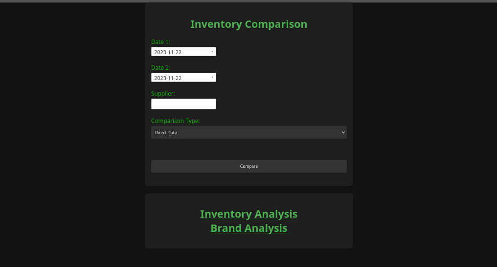
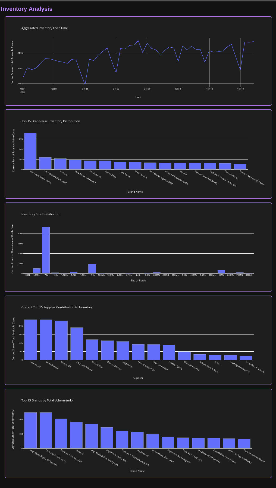
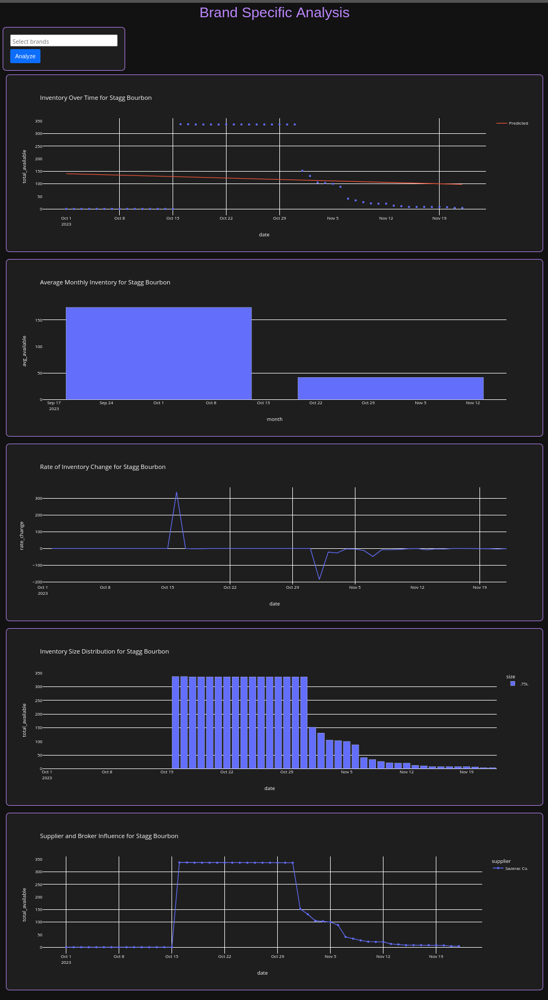

# NC ABC Inventory Comparison
## Description

This Flask web application allows users to compare inventory data from the North Carolina Alcoholic Beverage Control (NC ABC) between two selected dates, perform advanced data analysis, and analyze brand-specific inventory trends. Users can filter results based on a specific supplier, view inventory changes over time, and analyze data through various graphical representations including predictive analytics for brand availability.

## Features

* Compare inventory data between two dates.
* Option to filter comparison by a specific supplier.
* Visual display of inventory changes: new items, removed items, and quantity changes.
* Advanced data analysis with interactive graphs, including:
    * Inventory levels over time.
    * Brand-wise inventory distribution.
    * Inventory size distribution.
    * Supplier contribution to inventory.
    * Top 15 brands by total volume in milliliters.
* Brand-specific analysis with predictive trends:
    * Interactive brand selector with multi-select and type-ahead features.
    * Predictive graphs showing historical and projected inventory levels for selected brands.
    * Insights to anticipate when specific brands will be available on local shelves.

## Setup and Installation

To set up this project on your local machine, follow these steps:

1. **Clone the Repository**

   ```bash
   gh repo clone swiftraccoon/ncABC
   cd ncABC
   ```

2. **Install Dependencies**

   Ensure you have Python installed on your system. Then install the required Python packages:

   ```bash
   pip install -r requirements.txt
   ```

3. **Environment Variables**

   Create a `.env` file in the root directory of the project and set the following variables:

   ```
   DB_FILE_PATH=../data_management/inventory.db
   INVENTORY_URL=https://abc2.nc.gov/StoresBoards/ExportExcel
   BACKUP_DIR=../data_management/csv_bkups
   ```

4. **Running the Application**

   To run the application, execute:

   ```bash
   python app.py
   ```

   Visit `http://localhost:5000` in your web browser to view the main application.

   Data Analysis graphs are accessible at `http://localhost:5000/data-analysis`

## Usage

* On the home page, select two dates for which you want to compare inventory data.
* Optionally, specify a supplier to filter the comparison.
* Submit the form to view the comparison results.
* Access the advanced analysis section to view interactive graphs and insights into the inventory data.
* Use the brand-specific analysis feature to select one or multiple brands and view predictive trends and availability insights.

## Contributing

Contributions to this project are welcome. Please follow these steps to contribute:

1. Fork the repository.
2. Create a new branch for your feature (`git checkout -b feature/AmazingFeature`).
3. Commit your changes (`git commit -m 'Add some AmazingFeature'`).
4. Push to the branch (`git push origin feature/AmazingFeature`).
5. Open a pull request.

## License

Distributed under the GPL3 License. See `LICENSE` for more information.



